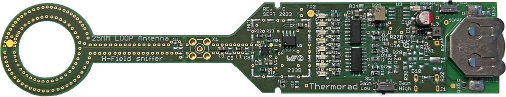

# Thermorad
Intuitive EMC tool with visual feedback

This tool is meant to be used for EMC investigation and EMC teaching, it provides a simple and quick feedback through an 8 LED indicator.

Possible use includes : 
- Locating near H-field emission sources 
- Locating near E-field emission sources (requires E Field antenna)
- Demonstrating polarisation of emitters-receivers
- Locating wifi and 4G/5G antennas on a phone
- Evaluation of perturbations carried by a cable (requires ferrite clamp)

Coming next
- Version D with Geiger like sound output
- E-Field antenna
- Small diameter H Field antenna
